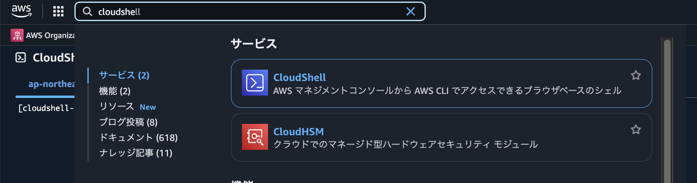
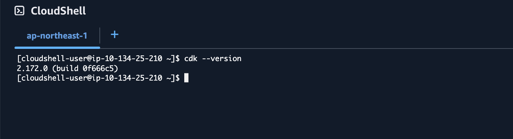
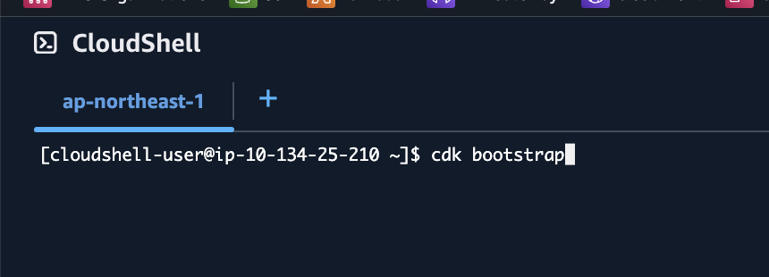
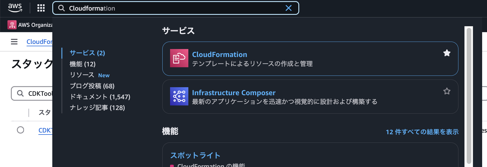
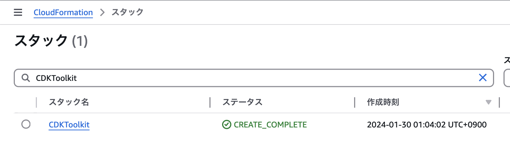
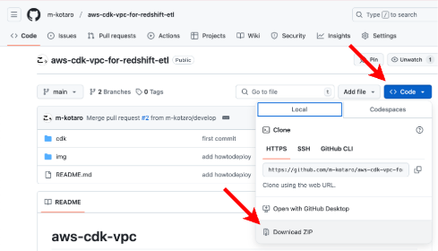
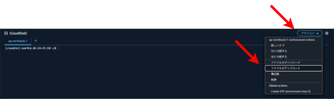
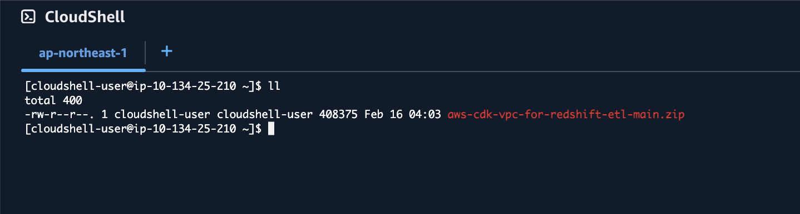

# aws-cdk-vpc

## 概要

本リポジトリの使い方とデプロイの仕方についてメモ

## CDK初期構築手順

### CloudShell

CloudShellを起動



---

### CDK確認

```bash
cdk --version
```



---

### CDK Bootstrap

```bash
cdk bootstrap
```



---

### CloudFormation



---

### CDKToolkit

CDKToolkitができていればOK




## CDKデプロイ

### ソースダウンロード



### ソースアップロード



### 確認

```bash
ll
```



---

## npm install

```bash
unzip aws-cdk-vpc-for-redshift-etl-main.zip
cd aws-cdk-vpc-for-redshift-etl-main/cdk/
npm install

```

## 構築用環境変数設定

```bash
export systemId= #
export systemNumber= #

```

## スタック作成

```bash
cdk synth -c systemId=$systemId -c systemNumber=$systemNumber
cdk deploy -c systemId=$systemId -c systemNumber=$systemNumber

```

## スタック削除

```bash
cdk destroy -c systemId=$systemId -c systemNumber=$systemNumber

```
